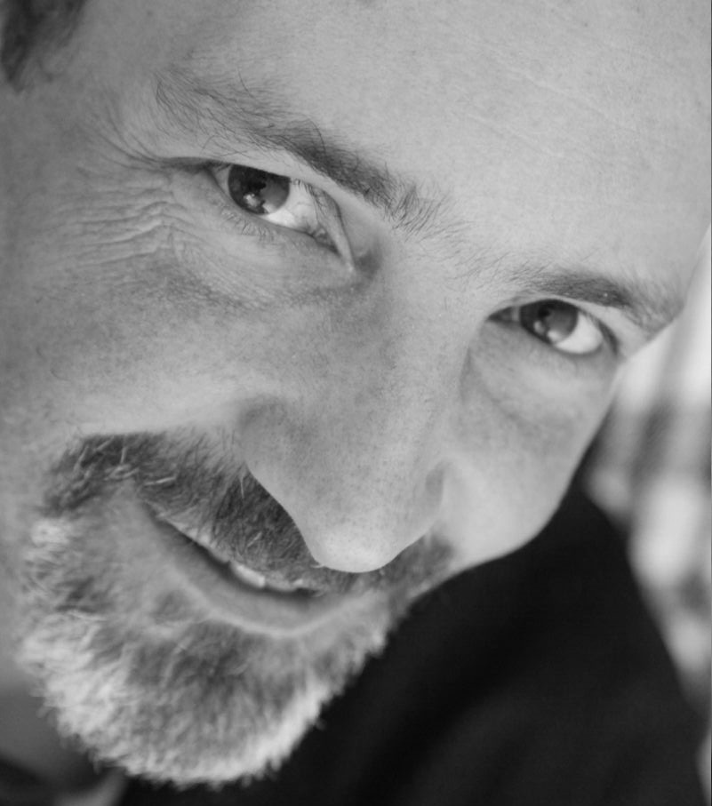

# Biografía de Ernesto Nicola

Ernesto Nicola nació en Argentina, pero reside en Mallorca desde hace varios años, después de haber vivido muchos años en Alemania, España y Suecia.

Se doctoró en Física en el [Instituto Max Planck][MPIPKS] de Dresde (Alemania) y ha trabajado como docente e investigador en diversas universidades españolas y alemanas: 
* [Universitat de Barcelona][UB],  
* Universitat de les Illes Balears (en el [IFISC; Instituto de Física Interdisciplinar y Sistemas Complejos][IFISC]), 
* [Universität Bayreuth][UBay] (Alemania), 
* [Technische Universität Berlin][TUB] (Alemania) y 
* [Technische Universität Dresden][TUD] (Alemania).

Aficionado a la astronomía desde hace varios años, con un especial interés en la divulgación científica de la astronomía y la astrofísica. Durante los últimos años ha dictados numerosos cursos y charlas de divulgación astronómica para la asociación [AstroMallorca][AM].  Actualmente es vicepresidente de [AstroMallorca][AM]. 

[MPIPKS]:https://www.pks.mpg.de/
[UB]:https://www.ub.edu/portal/web/fisica
[IFISC]:https://ifisc.uib-csic.es/es/
[UBay]:https://www.physik.uni-bayreuth.de/en/
[TUB]:https://www.physics.tu-berlin.de/
[TUD]:https://tu-dresden.de/mn/physik
[AM]:https://astromallorca.wordpress.com/
